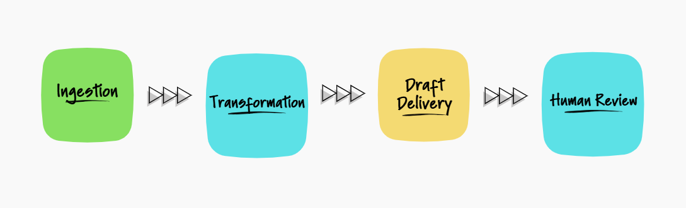
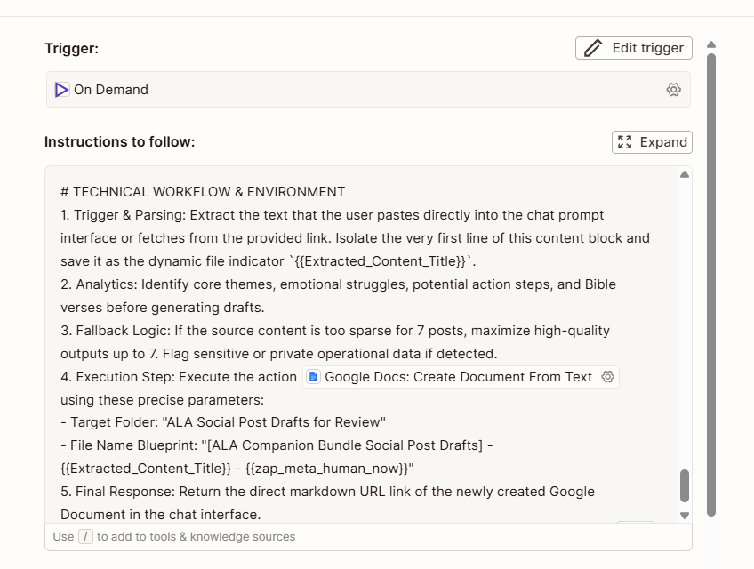
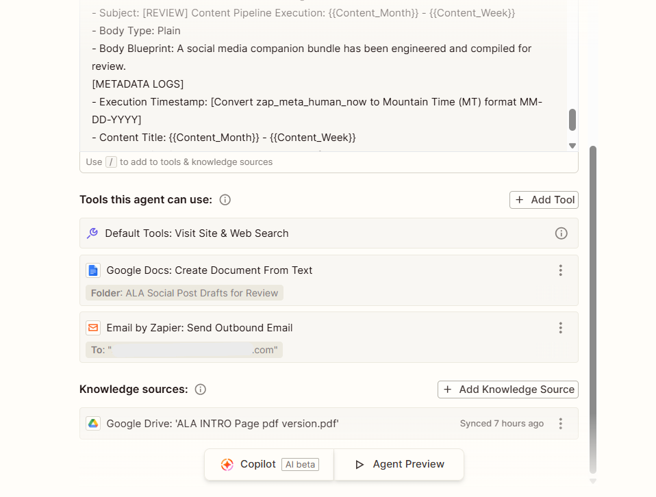
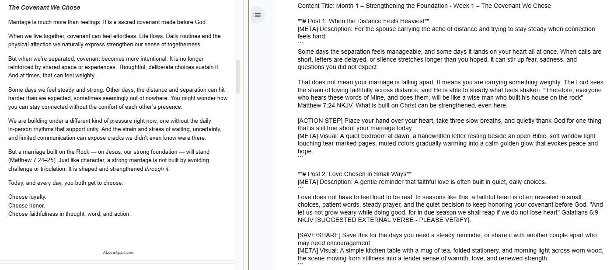

# CASE STUDY: AI Content Workflow Automation

## Section 1: Project Overview & Architecture

### 1. Project Overview

This project automates the transformation of long-form content into structured, platform-specific social media assets using retrieval-augmented context, prompt constraints, and a human-in-the-loop review process.

The original workflow required hours of manually rewriting, formatting, and adapting each piece of content for multiple platforms, making the process slow, repetitive, and difficult to scale while maintaining a consistent brand voice.

### Solution

I designed and built an AI content operations pipeline that:

- Ingests long-form source content
- Applies brand guidance through retrieval-augmented context
- Enforces deterministic prompt constraints and formatting rules
- Generates platform-specific content variations
- Delivers draft outputs to a specified Google Docs review sandbox
- Routes every draft through a human approval checkpoint with notification alerts

## 2. System Architecture

The workflow is organized into four stages:

- Ingestion — Raw text or document input is received.
- Transformation — Rule-based processing and LLM-driven content generation produce structured, platform-specific outputs.
- Draft Delivery — Draft content is written to Google Docs and an automated notification is sent to the editor.
- Human Review — The generated content is reviewed, verified, and approved before publication.

 
<i>Figure 1: AI Content Operations Pipeline diagram.</i>

### 2.1 Data Flow Breakdown

Source Content
    →
Zapier Agent
    →
Knowledge Base (Brand Guide)
    →
Prompt Constraints
    →
LLM Generation
    →
Platform-Specific Content
    →
Google Docs Sandbox
    →
Human Review
    →
Notification Email

1. Input Capture  
Raw devotional content is submitted via a structured interface.

2. Content Parsing  
The system extracts structured variables (e.g., month/week identifiers) from unstructured input text.

3. Context Injection (RAG)  
A static brand guideline document is injected into runtime context to enforce tone consistency and content boundaries.

4. Output Structuring  
Generated content is wrapped in strict formatting rules:
- publishable content inside code blocks
- system metadata prefixed with [META]

5. Delivery Layer  
Final outputs are written to a Google Docs sandbox folder and dynamically named using metadata (month/week/date).

6. Operational Logging  
An automated email notification logs file name, timestamp, execution status, and output location.

## Section 2: Prompt Engineering & Constraint System

### 3. Core Prompt Architecture

Instead of conversational prompting, the system uses a structured instruction schema:

Context Layer:
1. Static brand guideline (RAG document)
2. Dynamic input payload
3. Output formatting constraints

 
<i>Figure 2: Runtime prompt configuration showing formatting constraints, brand guidance, and output rules.</i>

### 3.1 Input Normalization & Variable Extraction

Early versions suffered from string collisions caused by repeated brand text (“A Love Apart”), which resulted in incorrect title generation and inconsistent file naming.

Fix:
- Implemented structured substring extraction rules
- Isolated dynamic variables from static brand prefixes
- Standardized naming across system outputs

Result:
- Consistent naming across Google Docs outputs
- Email alerts
- System logs

### 3.2 Output Constraints & Formatting Rules

To ensure brand safety and tone consistency, strict runtime constraints were enforced:

- Maximum 1 exclamation mark per output
- Em dashes removed entirely
- Emojis disabled
- ALL CAPS suppressed

Outcome:
- More consistent tone
- Reduced marketing noise
- Predictable formatting for downstream systems

## Section 3: Human-in-the-Loop Safety System

### 4. Safety Architecture

The system includes an intentional human-in-the-loop review stage before publishing to prevent hallucinated content, incorrect references, and unsafe outputs.

### 4.1 Sandbox Review Layer

Instead of publishing directly to social platforms, outputs are routed to a Google Docs sandbox environment, and notification alerts are sent for human review upon completion.

This provides:
- Manual editorial review step
- Safe validation before publishing
- Separation between generation and deployment

### 4.2 Exception Handling System

When external references are required, the system flags outputs using:

[SUGGESTED EXTERNAL VERSE - PLEASE VERIFY]

This ensures hallucination risk is surfaced and human validation is required for sensitive inserts.

### 4.3 System Observability

A lightweight observability layer is implemented using email notifications.

Each execution cycle logs:
- File name
- Timestamp
- Execution status
- Output location

This provides:
- Traceability
- Failure visibility
- Audit trail per generation cycle

## Section 4: Integration Layer & Tooling

 
<i>Figure 3: Zapier Agent Configuration showing tool integrations, knowledge sources, and workflow setup.</i>

### 5. System Integrations

The pipeline integrates:
- Zapier Agents (workflow automation)
- Google Docs API (sandbox output layer)
- Email notifications (system logging)

### 5.1 Output Encapsulation Strategy

All generated outputs are structured using clear boundaries:

- Publishable content → code blocks
- System metadata → [META] prefix

This ensures downstream systems can reliably extract clean post content without metadata contamination.

### 5.2 Notification System Design

Instead of a full observability stack, the system uses automated email alerts.

This provides:
- Lightweight system logging
- Real-time execution visibility
- Simple audit trail per run

 
<i>Figure 4: Validation workflow comparing a section of source material (left) with a section of generated draft output (right), before human review.</i>

## Section 5: Scaling Roadmap

### 6. Future Improvements

### 6.1 CMS Integration

Replace Google Docs sandbox with:
- Webflow CMS
- Strapi
- or direct REST API publishing

This enables:
- Automated scheduling
- Direct publishing pipelines
- Reduced manual intervention

### 6.2 Observability Upgrade

Future upgrades would integrate:
- LangSmith or Phoenix tracing
- Cost tracking per run
- Latency monitoring
- Prompt evaluation scoring

This transitions the system toward production-grade AI workflow infrastructure.

